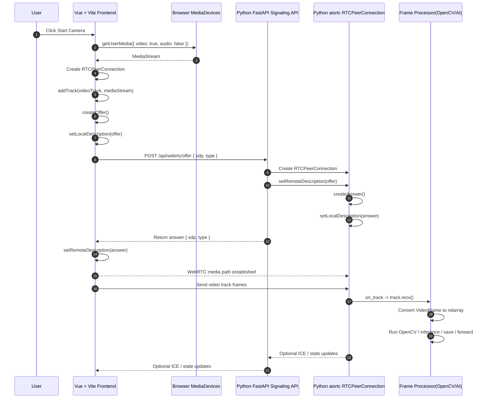

# Vue + Python WebRTC Architecture

## 目標

本專案目前使用 Python sender 與 Python receiver 直接建立 WebRTC 連線。

目標架構改為：

- 前端使用 Vue 3 + Vite。
- 瀏覽器使用 `getUserMedia()` 擷取攝影機。
- 前端建立 `RTCPeerConnection` 並將本地視訊 track 傳送出去。
- Python 後端使用 FastAPI 提供 signaling API。
- Python 後端使用 `aiortc` 建立另一端的 `RTCPeerConnection`。
- Python 後端在收到視訊後，交由 OpenCV 或 AI 流程處理。

## 架構概觀

### 目前架構

- `sender.py` 讀取本機攝影機或影片檔。
- `receiver.py` 接收遠端視訊 track。
- `aiortc.contrib.signaling.TcpSocketSignaling` 用來交換 SDP。
- 目前沒有瀏覽器前端，也沒有適合 browser client 的 signaling service。

### 目標架構

- Vue 頁面負責攝影機權限、預覽、開始/停止送流、顯示連線狀態。
- 瀏覽器端建立 WebRTC offer，Python 後端回傳 answer。
- WebRTC 媒體資料由瀏覽器直接送到 Python peer。
- Python 後端在 `on_track` 與 `track.recv()` 中持續消費視訊 frame。
- 視訊 frame 可進一步做 OpenCV、模型推理、儲存或轉發。

## 元件職責

### 前端: Vue 3 + Vite

- 呼叫 `navigator.mediaDevices.getUserMedia({ video: true, audio: false })`
- 本地預覽使用者攝影機畫面
- 建立 `RTCPeerConnection`
- 將 `MediaStreamTrack` 加入 peer connection
- 建立 offer 並送到後端 signaling API
- 接收 answer 並完成 WebRTC 協商
- 顯示 `connectionState` 與錯誤訊息

### 後端: FastAPI + aiortc

- 提供 `/api/webrtc/offer` 或 WebSocket signaling 端點
- 為每個前端 session 建立 `RTCPeerConnection`
- 接收前端送來的 SDP offer
- 建立 SDP answer 並回傳給前端
- 在 `@pc.on("track")` 中接收視訊 track
- 持續透過 `await track.recv()` 取得 `VideoFrame`
- 將影像 frame 轉成 ndarray 後交由 OpenCV 或模型處理

### Frame Processor

- 將 `VideoFrame` 轉成 NumPy ndarray
- 做時間戳、影像前處理或可視化
- 執行 AI 推理或影像分析
- 視需求儲存結果或輸出 metadata

## 流程圖



## 流程說明

1. 使用者在前端按下啟動按鈕。
2. Vue 頁面呼叫 `getUserMedia()` 取得攝影機畫面，回傳 `MediaStream`。
3. 前端建立一個 `RTCPeerConnection`。
4. 前端把攝影機的 video track 加進 peer connection。
5. 前端建立 offer，並設定自己的 local description。
6. 前端將 offer 傳給 Python 後端的 signaling API。
7. Python 後端建立自己的 `RTCPeerConnection`。
8. Python 後端將前端送來的 offer 設成 remote description。
9. Python 後端建立 answer，並設定自己的 local description。
10. Python 後端將 answer 回傳給前端。
11. 前端收到 answer 後，將其設為 remote description。
12. 前後端完成 WebRTC 協商後，瀏覽器開始把視訊媒體送到 Python。
13. Python 後端在 `on_track` 中收到遠端視訊 track。
14. Python 後端透過 `track.recv()` 逐幀取得影像資料。
15. 每一幀都可以交由 OpenCV、模型推理、儲存或後續轉發邏輯處理。

## 為什麼前後端都需要 RTCPeerConnection

`RTCPeerConnection` 是 WebRTC 連線兩端的核心物件，不是只有前端需要。

前端需要它，因為前端要：

- 持有本地攝影機 track
- 建立 offer
- 交換 ICE 與 SDP
- 把本地媒體送到遠端

後端也需要它，因為 Python 不是純粹的 signaling server，而是這條 WebRTC 連線的另一個 peer。後端要：

- 接收 offer
- 建立 answer
- 完成 ICE、DTLS、SRTP 協商
- 收到遠端視訊 track
- 把遠端視訊 frame 交給後端處理流程

signaling API 只負責交換協商資料，不負責承載媒體流。

## 建議的實作邊界

### 第一階段

- 先只做 video，不加入 audio
- 先支援單一瀏覽器對單一 Python 後端
- signaling 先用 HTTP offer/answer 跑通
- 後端先確認可以穩定收到 frame

### 第二階段

- 增加 WebSocket signaling
- 支援 trickle ICE
- 補上 STUN 設定
- 規劃 TURN 以支援複雜網路環境

### 第三階段

- 加入裝置切換與重連控制
- 加入模型推理與結果回傳
- 規劃多人 session 與資源回收

## 建議目錄方向

```text
frontend/
  src/
    views/
    components/
    composables/
    api/

backend/
  app.py
  webrtc/
    signaling.py
    peer_manager.py
    processor.py
```

## 實作注意事項

- `getUserMedia()` 在非 localhost 環境通常需要 HTTPS。
- 第一版若使用 HTTP signaling，建議等 ICE gathering 結束後再送出 offer。
- 若要跨網段或外網測試，至少需要 STUN；正式環境通常還需要 TURN。
- 若後端只做即時處理，不建議每幀都輸出圖片到磁碟，容易造成 I/O 瓶頸。
- 每個連線都要妥善關閉 `RTCPeerConnection` 與相關任務，避免資源洩漏。

## 與執行計畫的對齊

目前主線實作與 exec plan 的關係如下：

- `002-backend-signaling-and-receiver-foundation.md`: 對應 `backend/app.py` 與 `backend/webrtc/` 中的 signaling、peer lifecycle、processor 掛點。
- `003-vue-camera-publisher-page.md`: 對應 `frontend/src/` 中的 publisher 頁面、local preview、以及 `useWebRtcPublisher`。
- `004-development-integration-and-networking.md`: 對應 Vite proxy、env 範例、CORS 與 ICE server 設定入口。
- `005-validation-and-documentation.md`: 對應 `README.md`、`validation_checklist.md`、以及本架構文件中的驗證與限制整理。

005 驗證目前聚焦在以下可重現路徑：

- localhost happy path: 前端建立 offer，後端回 answer，並在 Python 端收到 frame。
- stop / reload cleanup: 停止送流或重整頁面後，peer session 會在後端被回收。
- permission denied path: 瀏覽器拒絕攝影機權限時，前端會進入 error state。
- backend unavailable path: signaling backend 未啟動時，前端會顯示可操作的 backend health error。
- same-LAN direct-call baseline: browser 可直接呼叫 backend `/health`，更複雜網路拓撲則明確視為 STUN/TURN 的後續範圍。
